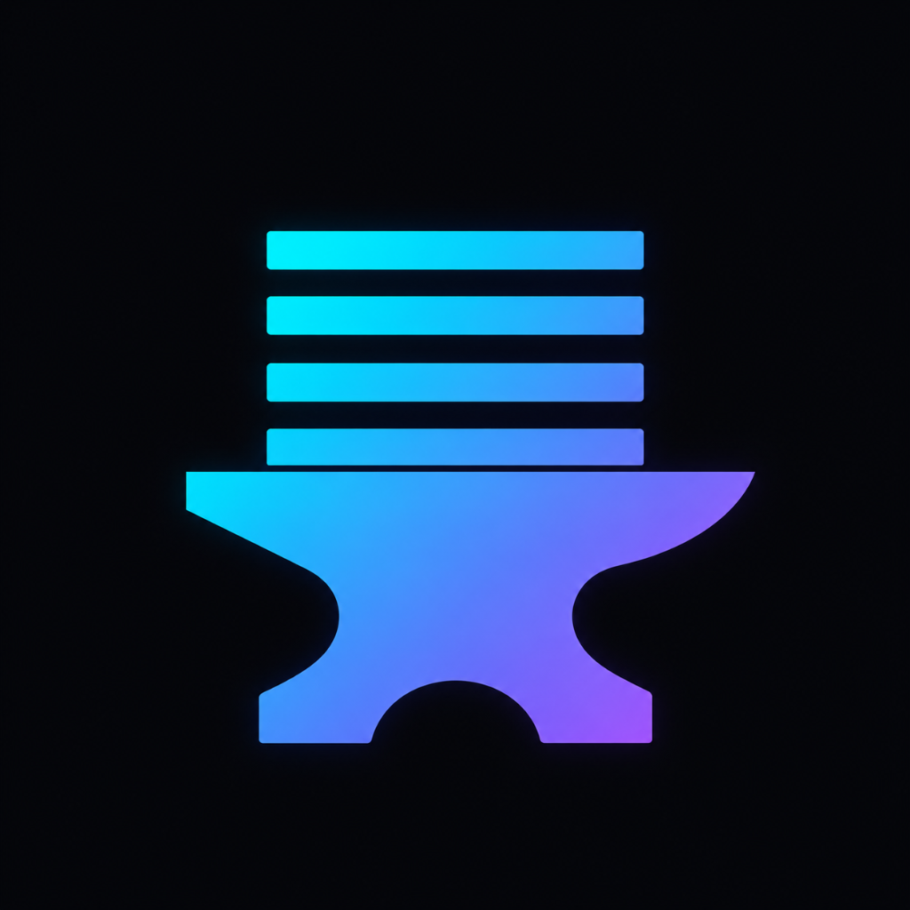
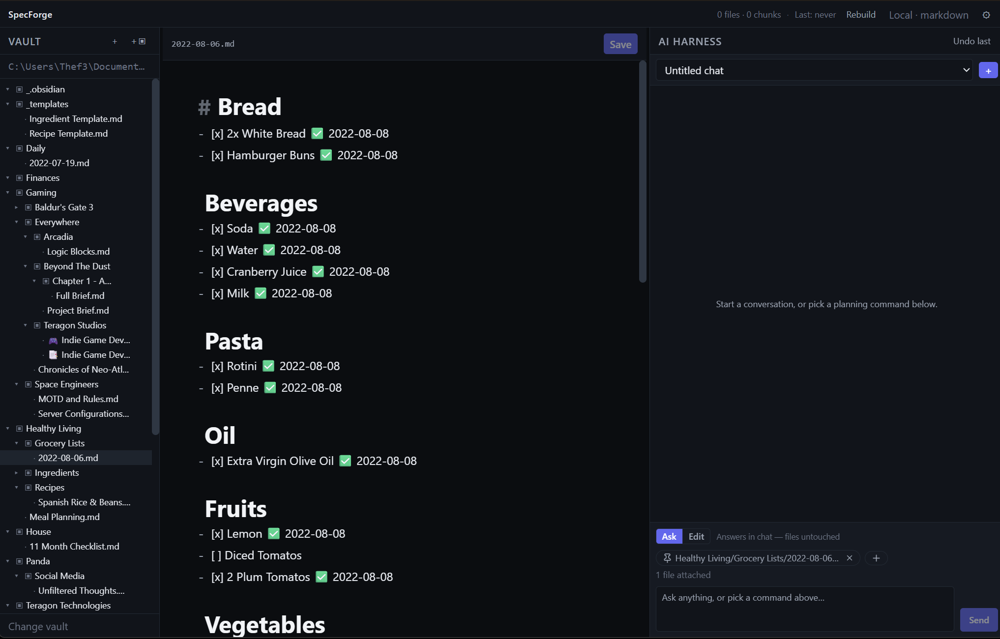
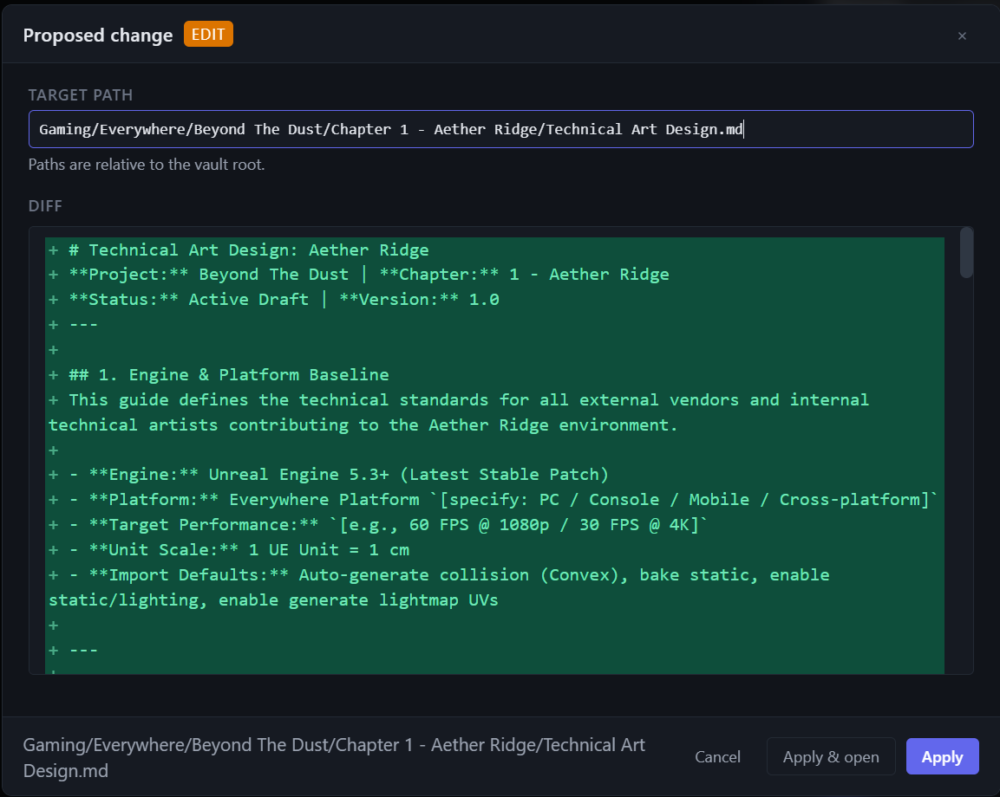
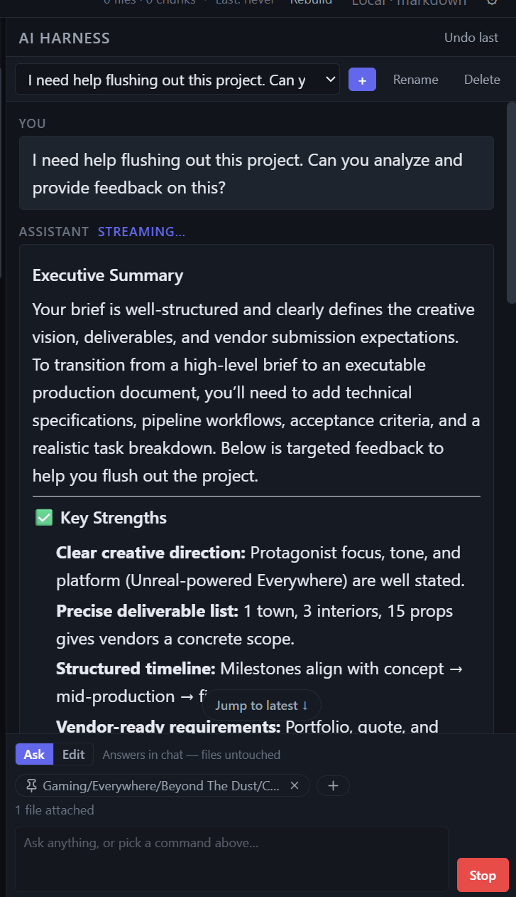

<p align="center">
  
</p>

<h1 align="center">SpecForge</h1>

<p align="center">
  A local-first, AI-assisted markdown workspace for planning software.
</p>

<p align="center">
  <a href="https://github.com/CraigSalajan/specforge/releases/latest"></a>
  &nbsp;
  
  &nbsp;
  
</p>

---

SpecForge is a quiet, dark, keyboard-friendly editor for the documents you write *before* you write code — PRDs, architecture decisions, implementation plans, and design docs. Your work lives as plain markdown files in a folder on your own computer, and an AI assistant sits alongside the editor to help you draft, connect, and refine those documents. The AI always *proposes* changes for you to review and approve — it never edits your files behind your back.

It's built for people who think in markdown and want their planning tools to get out of the way.

## Screenshots

<p align="center">
  
  <br/>
  <sub>The three-pane workbench — file tree, editor, and AI panel.</sub>
</p>

<p align="center">
  
  <br/>
  <sub>Every AI change is proposed first — review the diff, then apply or cancel.</sub>
</p>

<p align="center">
  
  <br/>
  <sub>Ask the AI about your vault and run one-click planning commands.</sub>
</p>

## What you get

- **Local-first, plain files.** Your notes are ordinary `.md` files in a folder you choose. Open them in any other editor too — nothing is trapped in a proprietary format.
- **A focused three-pane workbench.** File tree on the left, editor in the middle, AI assistant on the right.
- **A real markdown editor.** Live editing with syntax highlighting and a clean preview, tuned for long, deep-focus writing sessions.
- **An AI planning assistant.** Ask questions about your own notes and generate structured documents — PRDs, ADRs, implementation plans, user stories — from one-click planning commands.
- **You stay in control.** Every change the AI wants to make is shown first — a side-by-side diff for edits, a full preview for new files. Apply it, open it, or cancel. Made a mistake? **Undo the last change** in one click.
- **Search that understands your vault.** Find things by keyword and by meaning across all your documents.
- **Bring your own AI.** Works with any OpenAI-compatible provider — OpenAI, OpenRouter, or a local model via Ollama or LM Studio. You use your own key.
- **Calm by design.** A near-black dark theme, keyboard-first, no clutter, no noise.

## Download

Grab the installer for your operating system from the **[latest release](https://github.com/CraigSalajan/specforge/releases/latest)**:

| OS | File |
| --- | --- |
| Windows | `SpecForge-Setup-*.exe` |
| macOS | `SpecForge-*.dmg` |
| Linux | `SpecForge-*.AppImage` or `*.deb` |

Then open it and follow the installer.

## Getting started

1. **Open a vault.** On first launch, pick a folder to work in. It can be full of existing notes or completely empty — SpecForge just reads and writes markdown files there.
2. **Start writing.** Create and edit documents in the editor. Everything saves as plain `.md` on your disk.
3. **Connect an AI provider (optional).** Open **Settings** and enter your provider's API details (see below). The AI panel comes to life as soon as a key is saved.
4. **Use the planning commands.** The AI panel's toolbar can draft a PRD, an ADR, an implementation plan, user stories, and more — using the context of the notes already in your vault.
5. **Review before anything changes.** When the AI proposes a new file or an edit, you'll see exactly what it wants to do. Approve it, approve-and-open it, or cancel. Use **Undo last** if you change your mind.

## Connecting an AI provider

SpecForge talks to any **OpenAI-compatible** API. In **Settings**, you provide three things: a base URL, a model name, and your API key.

| Provider | Base URL | Example model |
| --- | --- | --- |
| OpenAI | `https://api.openai.com/v1` | `gpt-4o-mini` |
| OpenRouter | `https://openrouter.ai/api/v1` | any model OpenRouter lists |
| Ollama (local) | `http://localhost:11434/v1` | e.g. `llama3.1` |
| LM Studio (local) | `http://localhost:1234/v1` | whatever you've loaded |

Your API key is stored locally on your own machine and is only ever used to talk to the provider you configure.

## Your data & privacy

- **Your notes stay on your computer.** They're plain markdown files in your vault folder. SpecForge does not upload them anywhere on its own.
- **The only thing that leaves your machine** is the text SpecForge sends to *your* chosen AI provider — and only when you actually use an AI feature.
- **Settings and chat history** are kept in a small local database in your user app-data folder, separate from your vault, so your vault stays portable plain text.

## Running from source (advanced)

Most people should just download an installer above. If you'd like to run SpecForge from source for your own personal use, you'll need [Node.js](https://nodejs.org/) 22 or newer and npm:

```bash
npm install
npm start
```

Please note the source code is provided under a source-available license that does **not** permit modifying or redistributing it — see [License](#license) below.

## License

SpecForge is **source-available, not open source.**

You are free to **download and use the app for any purpose** — personal or commercial — at no cost. The source code is published here for transparency and reference only: you may **not** copy, modify, redistribute, or build derivative works from it.

See the [LICENSE](LICENSE) file for the full terms.

## Contributing

I'm sharing SpecForge's source openly, but I'm **not accepting contributions or feature requests** at this time. You're welcome to open an issue to report a bug, but please don't submit pull requests — they will be closed. Thanks for understanding.

---

<p align="center"><sub>SpecForge · © 2026 Teragon Technologies LLC</sub></p>
